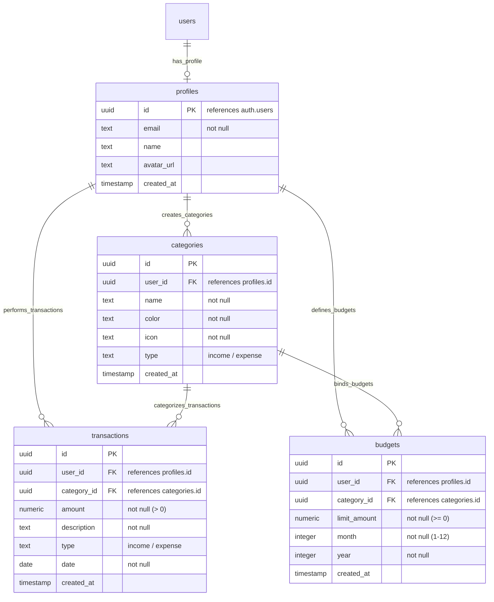
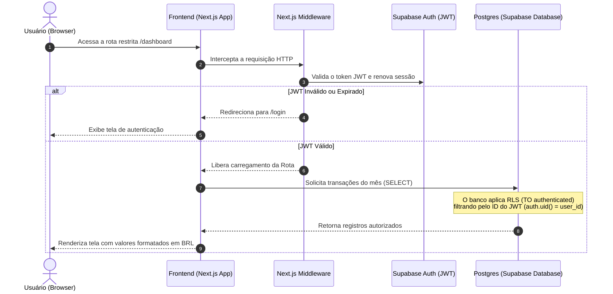

# App de Orçamento Pessoal

Aplicação web premium e de alta fidelidade para controle de finanças pessoais, focada em segurança na fonte, precisão em cálculos financeiros e integridade de dados.

---

## 1. Visão Geral

O sistema permite que o usuário gerencie seu fluxo de caixa pessoal. Ele resolve problemas comuns de arredondamento financeiro em ponto flutuante utilizando precisão decimal estrita, fornece um painel interativo de evolução de receitas e despesas e assegura o controle de acesso de dados diretamente na fonte (banco de dados) através de políticas rígidas de RLS (Row-Level Security) no Supabase.

---

## 2. Stack Tecnológica

- **Framework Web**: [Next.js 16 (App Router)](https://nextjs.org/)
- **Visualização & Interface**: React 19, Lucide React (Ícones)
- **Estilização**: Vanilla CSS (CSS Variables) para fidelidade e design premium adaptado a modo escuro
- **Banco de Dados & Autenticação**: [Supabase](https://supabase.com/) (PostgreSQL & Supabase Auth)
- **Manipulação de Moeda**: [Big.js](https://github.com/MikeMcl/big.js) para prevenção de imprecisão centesimal
- **Ambiente de Testes**: [Vitest](https://vitest.dev/) & React Testing Library

---

## 3. Estrutura do Projeto

Abaixo está o mapeamento da estrutura real do projeto:

```text
├── .agents/                      # Configurações e diretrizes dos agentes AI
├── public/                       # Arquivos e assets estáticos
├── supabase/
│   └── migrations/               # Esquema de banco de dados e políticas RLS
├── src/
│   ├── app/                      # Páginas e Rotas do App Router
│   │   ├── (auth)/               # Grupo de Rotas de Autenticação (Login/Register)
│   │   ├── (dashboard)/          # Rotas Protegidas (Dashboard, Transações, Categorias, Orçamentos)
│   │   ├── auth/callback/        # Rota de callback para OAuth do Supabase
│   │   ├── globals.css           # Estilização global da aplicação
│   │   ├── layout.tsx            # Layout base da aplicação
│   │   └── page.tsx              # Página raiz (redirecionador seguro)
│   ├── components/               # Componentes compartilhados (Gráficos, Sidebar, Modais)
│   ├── lib/                      # Utilitários e Clientes
│   │   ├── supabase/             # Instanciação dos clientes Supabase (Client/Server/Middleware)
│   │   └── utils/                # Calculadoras financeiras (Big.js) e formatador de moeda BRL
│   └── middleware.ts             # Middleware de verificação e renovação de sessões do Next.js
├── eslint.config.mjs             # Configuração do ESLint com regras customizadas
├── package.json                  # Dependências e scripts npm
├── tsconfig.json                 # Configuração do TypeScript
└── vitest.config.ts              # Configuração da suíte de testes Vitest
```

---

## 4. Arquitetura de Dados (Diagrama ERD)

O banco de dados armazena os dados sob o esquema `public` utilizando as seguintes relações integradas com cascade de forma nativa:



---

## 5. Fluxo de Dados e Segurança da Informação

O fluxo de dados implementa os princípios de **Segurança na Fonte** e **Salvaguarda de Exclusão**:



---

## 6. Integridade Financeira & Regras Globais Aplicadas

1. **Precisão Centesimal**: Toda soma e subtração monetária do sistema é calculada utilizando a biblioteca `big.js` (em [budgetCalculator.ts](file:///c:/Dev/Curso Antigravity/App-Orcamento-Pessoal/src/lib/utils/budgetCalculator.ts)), prevenindo imprecisões decimais como `0.1 + 0.2 = 0.30000000000000004`.
2. **Formatação Padronizada**: Valores monetários são apresentados exclusivamente por meio do formatador BRL localizado em [format.ts](file:///c:/Dev/Curso Antigravity/App-Orcamento-Pessoal/src/lib/utils/format.ts).
3. **Segurança na Fonte (Database-Level Security)**:
   - RLS habilitado em todas as tabelas, limitando todas as consultas exclusivamente a usuários autenticados (`TO authenticated`).
   - Revogação de privilégios de execução pública (`EXECUTE`) na função de trigger cadastral `handle_new_user()` para blindar invocações não autenticadas via REST API.
4. **Salvaguarda Contra Exclusão**: Remoções de transações ou categorias exigem a concordância explícita do usuário por meio de **3 confirmações consecutivas na interface**, detalhando o impacto de desvinculação em cascata.

---

## 7. Guia de Execução Local

### Pré-requisitos
- Node.js (versão 18+)
- Conta e Projeto configurado no [Supabase](https://supabase.com/)

### Instalação
1. Clone o repositório e instale as dependências:
   ```bash
   npm install
   ```

2. Crie e configure o arquivo `.env.local` na raiz com suas credenciais obtidas no Painel do Supabase (*Settings > API*):
   ```env
   NEXT_PUBLIC_SUPABASE_URL=https://<seu-project-id>.supabase.co
   NEXT_PUBLIC_SUPABASE_ANON_KEY=<sua-anon-key-aqui>
   ```

3. Execute as migrações SQL localizadas na pasta `supabase/migrations/` diretamente no Editor de SQL do painel do seu projeto Supabase (primeiro execute `20260716_initial_schema.sql` e em seguida `20260718_global_rules_security.sql`).

### Desenvolvimento
Inicie o servidor local:
```bash
npm run dev
```
Acesse a aplicação em [http://localhost:3000](http://localhost:3000).

### Testes & Qualidade
Para rodar a suite de testes unitários:
```bash
npm run test
```

Para validar a conformidade das regras do linter:
```bash
npm run lint
```
